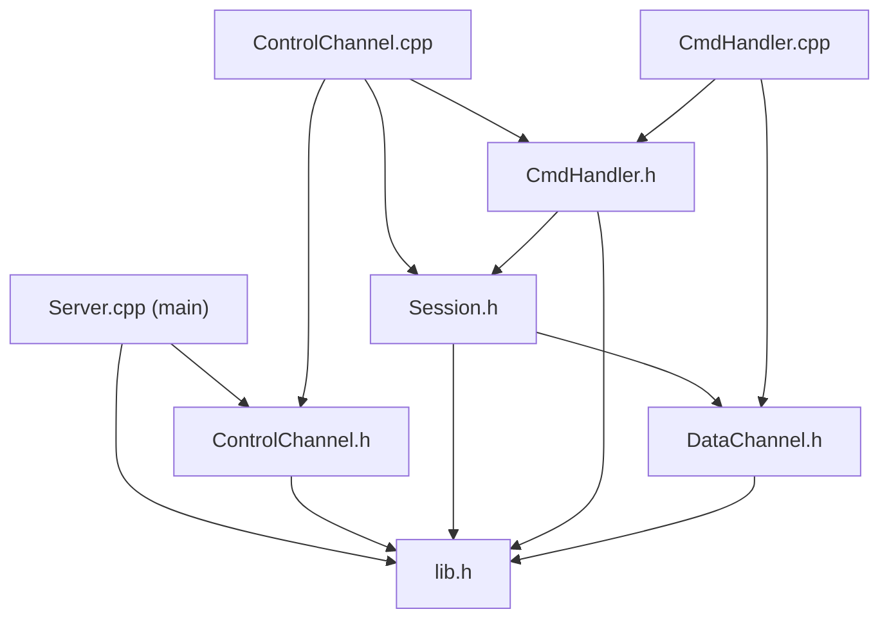
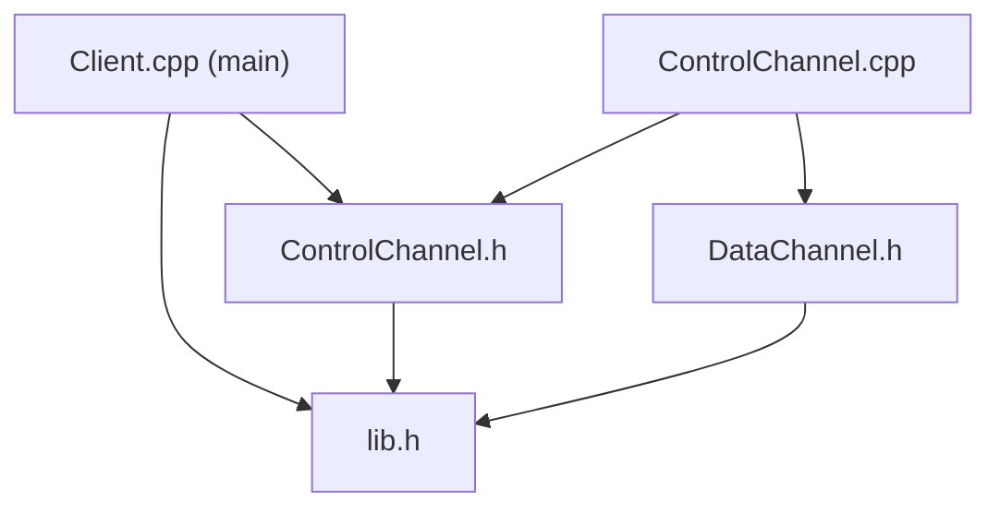

# Giai đoạn 6 — Reliable Data Transfer (RDT) qua Stop-and-Wait ARQ

## 1. PHÂN TÍCH TOÀN BỘ PROJECT HIỆN TẠI

### 1.1 Cấu trúc project

```
PROJECT
├── CLIENT - 6/
│   └── CLIENT/
│       ├── lib.h              — Includes chung, hằng số (CONTROL_PORT, SERVER_DATA_PORT, CLIENT_DATA_PORT, CHUNK_SIZE), enum ClientDataMode
│       ├── Client.cpp         — main(): WSAStartup → ControlChannel → run → stop → WSACleanup
│       ├── ControlChannel.h   — Kênh điều khiển TCP phía Client
│       ├── ControlChannel.cpp — Vòng lặp bàn phím + thread nền nhận reply + gọi doDataTransfer()
│       ├── DataChannel.h      — Kênh dữ liệu UDP phía Client
│       └── DataChannel.cpp    — sendFile / receiveFile / sendProbe / sendFileAfterHandshake / stop
│
└── SERVER - 6/
    └── SERVER/
        ├── lib.h              — Includes chung, hằng số, SERVER_ROOT, g_coutMutex, enum DataMode, enum FtpCommand
        ├── Server.cpp         — main(): WSAStartup → tạo server_root → ControlChannel → run → stop
        ├── ControlChannel.h   — Kênh điều khiển TCP phía Server
        ├── ControlChannel.cpp — accept() vô hạn → mỗi client 1 thread detach → handleClient()
        ├── Session.h          — Trạng thái phiên (login, dir, type, mode, dataMode, activeDataChannel…)
        ├── Session.cpp        — Getter/Setter + abortActiveTransfer()
        ├── CmdHandler.h       — Bộ xử lý 28 lệnh FTP
        ├── CmdHandler.cpp     — Toàn bộ logic xử lý lệnh FTP
        ├── DataChannel.h      — Kênh dữ liệu UDP phía Server (giống hệt Client)
        ├── DataChannel.cpp    — sendFile / receiveFile / sendProbe / sendFileAfterHandshake / stop
        └── server_root/       — Thư mục gốc chứa file của server
```

### 1.2 Dependency giữa các file

#### SERVER


#### CLIENT


### 1.3 Luồng hoạt động tổng thể

```
CLIENT                                          SERVER
──────                                          ──────
main()                                          main()
  │                                               │
  ├── WSAStartup                                  ├── WSAStartup
  │                                               ├── create server_root/
  ├── ControlChannel(8080, "127.0.0.1")           ├── ControlChannel(8080)
  │     │                                         │     │
  │     ├── start()                               │     ├── start()
  │     │     └── socket → connect                │     │     └── socket → bind → listen
  │     │                                         │     │
  │     ├── run()                                 │     ├── run()
  │     │     ├── recv() lần đầu (greeting 220)   │     │     └── accept() loop
  │     │     ├── spawn receiverThread            │     │           └── thread detach
  │     │     │     └── receiverLoop()            │     │                 └── handleClient()
  │     │     │           ├── recv() TCP reply     │     │                       ├── send "220"
  │     │     │           ├── parse 227 → PASV     │     │                       ├── recv() loop
  │     │     │           ├── parse 150 → call     │     │                       │     ├── parseCmd()
  │     │     │           │   doDataTransfer()     │     │                       │     ├── handler.handle()
  │     │     │           └── loop                 │     │                       │     └── send reply
  │     │     │                                    │     │                       └── closesocket
  │     │     └── keyboard loop                   │     │
  │     │           ├── getline(cin)               │     └── stop()
  │     │           ├── parse PORT → save port     │
  │     │           ├── save pendingCmd             │
  │     │           └── send(TCP)                  │
  │     └── stop()                                 │
  └── WSACleanup                                  └── WSACleanup
```

### 1.4 DataChannel hoạt động như thế nào

`DataChannel` là class dùng chung **cả Server lẫn Client**, code giống hệt nhau. Nó quản lý 1 UDP socket để truyền dữ liệu dạng raw.

| Method | Chức năng |
|--------|-----------|
| `DataChannel(port)` | Lưu port, socket = INVALID_SOCKET |
| `start()` | Tạo UDP socket → bind INADDR_ANY:port → lưu vào `atomic<SOCKET>` |
| `sendFile(filepath, destIp, destPort)` | Mở file → đọc từng chunk 1024 bytes → `sendto()` → cuối cùng gửi gói rỗng (0 byte) báo EOF |
| `receiveFile(filepath, append)` | Mở file → vòng lặp `recvfrom()` → ghi vào file → nhận gói 0 byte = EOF → kết thúc |
| `sendFileAfterHandshake(filepath)` | PASSIVE+RETR: `recvfrom()` 1 gói probe → học IP:port client → gọi `sendFile()` |
| `sendProbe(destIp, destPort)` | Gửi 1 byte "R" tới server để server học địa chỉ client |
| `stop()` | `atomic exchange` INVALID_SOCKET → `closesocket()` |

> **Điểm mấu chốt:** Hiện tại DataChannel gọi `sendto()` / `recvfrom()` **trực tiếp** — không có ACK, không có retransmit, không có checksum. Đây là chỗ cần chèn tầng RDT vào.

### 1.5 CommandHandler gọi DataChannel ra sao

CommandHandler **không gọi sendto/recvfrom trực tiếp**. Nó tạo `DataChannel` object rồi gọi các method public:

```
CommandHandler::handleStor()
    │
    ├── dc = make_shared<DataChannel>(pickListenPort(s))
    ├── dc->start()
    ├── sendIntermediate("150 ...")
    ├── s.setActiveDataChannel(dc.get())         // để ABOR có thể dừng
    └── transferThread = thread([...]{
            dc->receiveFile(target)               // ← SERVER NHẬN file từ Client
            s.setActiveDataChannel(nullptr)
            dc->stop()
            sendIntermediate("226 ..." or "426 ...")
        })
```

Pattern tương tự cho RETR (nhưng gọi `sendFile` hoặc `sendFileAfterHandshake`), STOU, APPE.

### 1.6 Phân tích từng command liên quan data transfer

#### STOR (Upload: Client → Server)
- **Server:** `handleStor()` → `DataChannel(pickListenPort)` → `start()` → thread phụ gọi `receiveFile()` → `stop()`
- **Client:** `doDataTransfer("STOR")` → `DataChannel(0)` → `start()` → `sendFile(filename, serverIp, destPort)` → `stop()`
- **Luồng UDP:** Client `sendto()` từng chunk 1024B → Server `recvfrom()` → Client gửi gói 0 byte (EOF)

#### RETR (Download: Server → Client)
- **Server:** `handleRetr()` → `DataChannel(listenPort)` → `start()` → thread phụ:
  - PASSIVE: `sendFileAfterHandshake()` (chờ probe → `sendFile()`)
  - ACTIVE/NONE: `sendFile(destIp, destPort)`
- **Client:** `doDataTransfer("RETR")`:
  - PASSIVE: `DataChannel(0)` → `sendProbe()` → `receiveFile()`
  - ACTIVE: `DataChannel(myActivePort)` → `receiveFile()`
  - NONE: `DataChannel(CLIENT_DATA_PORT)` → `receiveFile()`
- **Luồng UDP:** Server `sendto()` từng chunk → Client `recvfrom()` → Server gửi gói 0 byte (EOF)

#### LIST / NLST (Listing — không dùng DataChannel)

> [!IMPORTANT]
> **LIST và NLST hiện tại KHÔNG dùng DataChannel.** Chúng tạo string body rồi ghép trực tiếp vào reply TCP: `"150 ...\r\n" + body + "226 ...\r\n"` và gửi qua **kênh điều khiển TCP**.
> 
> → **LIST/NLST không cần sửa gì cho Giai đoạn 6** vì chúng không đi qua UDP.

#### STOU / APPE (tương tự STOR)
- Cùng pattern: Server `receiveFile()`, Client `sendFile()`. APPE khác ở chỗ `append = true`.

---

## 2. KẾ HOẠCH TRIỂN KHAI GIAI ĐOẠN 6

### 2.1 Tổng quan thiết kế

```
TRƯỚC (Giai đoạn 5):
    DataChannel::sendFile()    → sendto() trực tiếp
    DataChannel::receiveFile() → recvfrom() trực tiếp

SAU (Giai đoạn 6):
    DataChannel::sendFile()    → rdtSend() → [RdtPacket serialize → sendto → chờ ACK → timeout → retransmit]
    DataChannel::receiveFile() → rdtReceive() → [recvfrom → RdtPacket deserialize → checksum → ACK → deliver]
```

Toàn bộ thay đổi nằm **bên trong DataChannel** và các file mới (RdtPacket). **CommandHandler, ControlChannel, Session không cần sửa.**

### 2.2 File cần tạo mới

#### [NEW] RdtPacket.h
Chứa:
- Hằng số flag: `FLAG_DATA`, `FLAG_ACK`, `FLAG_FIN`
- Hằng số cấu hình: `RDT_TIMEOUT_MS`, `RDT_MAX_RETRIES`, `RDT_MAX_PAYLOAD`, `SIMULATE_PACKET_LOSS`, `LOSS_PERCENT`
- Struct `RdtPacket` (chỉ để giữ dữ liệu trong bộ nhớ, KHÔNG gửi trực tiếp qua mạng)
- Hàm `computeChecksum()`
- Hàm `serializePacket()` — ghi từng field theo thứ tự vào mảng byte
- Hàm `deserializePacket()` — đọc từng field, kiểm tra payloadLength và checksum
- Hàm `shouldSimulateLoss()` — random drop packet theo tỉ lệ

#### [NEW] RdtPacket.cpp
Implement toàn bộ hàm trên.

### 2.3 File cần sửa

#### [MODIFY] DataChannel.h (cả Server lẫn Client — giống nhau)
- Thêm `#include "RdtPacket.h"`
- Thêm 2 method **private**:
  - `bool rdtSend(SOCKET s, const char* data, int len, const sockaddr_in& dest)` — gửi 1 buffer qua RDT (chia chunk → gói DATA → chờ ACK → FIN)
  - `int rdtReceive(SOCKET s, std::vector<char>& outData, sockaddr_in& senderAddr)` — nhận toàn bộ dữ liệu qua RDT (nhận DATA → ACK → đến FIN → trả buffer)
- **Interface public KHÔNG ĐỔI:** `start()`, `sendFile()`, `receiveFile()`, `sendFileAfterHandshake()`, `sendProbe()`, `stop()`

#### [MODIFY] DataChannel.cpp (cả Server lẫn Client — giống nhau)
- Thay thế `sendto()` bên trong `sendFile()` bằng `rdtSend()`
- Thay thế `recvfrom()` bên trong `receiveFile()` bằng `rdtReceive()`
- `sendProbe()` và `sendFileAfterHandshake()` cũng cần điều chỉnh vì probe/handshake giờ phải đi qua RDT
- Gói 0-byte EOF cũ → thay bằng gói FIN trong RDT protocol

### 2.4 Thiết kế RDT Packet

```
Offset  Field          Type       Size    Mô tả
──────  ─────          ────       ────    ─────
0       seqNum         uint32_t   4B      Sequence number (0 hoặc 1 cho Stop-and-Wait)
4       flags          uint8_t    1B      Bit flags: DATA=0x01, ACK=0x02, FIN=0x04
5       checksum       uint16_t   2B      Internet checksum (1's complement)
7       payloadLength  uint16_t   2B      Số byte payload (0 nếu ACK/FIN thuần)
9       payload        byte[]     0-1024B Dữ liệu thực
```

**Header size = 9 bytes**, payload tối đa = `CHUNK_SIZE` (1024 bytes), tổng packet tối đa = 1033 bytes.

### 2.5 Thuật toán Checksum

```
computeChecksum(data, length):
    1. Đặt field checksum trong data = 0 trước khi tính
    2. sum = 0 (uint32_t)
    3. Duyệt từng cặp 2 byte → cộng vào sum dưới dạng uint16_t (big-endian)
    4. Nếu length lẻ → byte cuối được pad 0x00 thành cặp 2 byte
    5. Fold carry: while (sum >> 16) → sum = (sum & 0xFFFF) + (sum >> 16)
    6. return ~(uint16_t)sum
```

Verify: Tính checksum trên toàn bộ packet (bao gồm cả field checksum) → kết quả phải = 0 nếu không lỗi.

### 2.6 Stop-and-Wait ARQ

#### Sender (rdtSend)
```
seqNum = 0
for each chunk of data:
    1. Tạo RdtPacket(seqNum, FLAG_DATA, payload)
    2. Tính checksum → ghi vào packet
    3. serialize → sendto()
    4. Chờ ACK (recvfrom với timeout)
       - Nếu nhận ACK đúng seqNum → seqNum ^= 1 → tiếp chunk kế
       - Nếu timeout → retransmit (tối đa MAX_RETRIES lần)
       - Nếu ACK sai seq hoặc checksum lỗi → bỏ qua, chờ tiếp
    5. Nếu hết retry → return false (lỗi)

Sau khi gửi hết data:
    6. Gửi FIN packet (seqNum, FLAG_FIN) → chờ ACK cho FIN
```

#### Receiver (rdtReceive)
```
expectedSeq = 0
while true:
    1. recvfrom()
    2. deserialize → kiểm tra checksum
       - Nếu checksum sai → DROP, KHÔNG ACK
    3. Nếu là FIN:
       - Gửi ACK(seqNum, FLAG_ACK)
       - break (kết thúc nhận)
    4. Nếu là DATA:
       - Nếu seqNum == expectedSeq → deliver (ghi vào buffer) → expectedSeq ^= 1
       - Nếu seqNum != expectedSeq → duplicate, không deliver
       - Gửi ACK(seqNum nhận được, FLAG_ACK) trong cả 2 trường hợp
```

### 2.7 Tích hợp vào DataChannel

| Method hiện tại | Thay đổi |
|-----------------|----------|
| `sendFile()` | Đọc file → gom toàn bộ data → gọi `rdtSend()` thay vì `sendto()` từng chunk. Không cần gửi gói 0-byte EOF nữa (FIN thay thế). |
| `receiveFile()` | Gọi `rdtReceive()` thay vì `recvfrom()` loop. `rdtReceive()` trả về toàn bộ data → ghi vào file. |
| `sendProbe()` | Gửi 1 byte "R" qua `rdtSend()` thay vì `sendto()` trực tiếp. |
| `sendFileAfterHandshake()` | `rdtReceive()` để nhận probe → học địa chỉ → `sendFile()` (đã dùng rdtSend). |

### 2.8 Packet Loss Simulation

```cpp
// Trong RdtPacket.h
constexpr bool SIMULATE_PACKET_LOSS = false; // Bật = true để test
constexpr int  LOSS_PERCENT = 10;            // 10% drop

// Hàm kiểm tra
bool shouldSimulateLoss(); // random 0-99, nếu < LOSS_PERCENT → drop
```

Chèn `shouldSimulateLoss()` tại:
- **Sender:** Trước `sendto()` → nếu true thì **không gửi** (giả lập mất gói)
- **Receiver:** Sau `recvfrom()` → nếu true thì **bỏ qua** gói nhận (giả lập mất gói)

---

## 3. DANH SÁCH FILE CẦN THAO TÁC

| # | File | Hành động | Lý do |
|---|------|-----------|-------|
| 1 | `SERVER/RdtPacket.h` | **TẠO MỚI** | Định nghĩa packet, checksum, serialize/deserialize |
| 2 | `SERVER/RdtPacket.cpp` | **TẠO MỚI** | Implement các hàm trên |
| 3 | `CLIENT/RdtPacket.h` | **TẠO MỚI** | Copy giống Server (dùng chung) |
| 4 | `CLIENT/RdtPacket.cpp` | **TẠO MỚI** | Copy giống Server (dùng chung) |
| 5 | `SERVER/DataChannel.h` | **SỬA** | Thêm `#include "RdtPacket.h"`, thêm `rdtSend()` + `rdtReceive()` private |
| 6 | `SERVER/DataChannel.cpp` | **SỬA** | Thay sendto/recvfrom trực tiếp bằng rdtSend/rdtReceive |
| 7 | `CLIENT/DataChannel.h` | **SỬA** | Giống Server |
| 8 | `CLIENT/DataChannel.cpp` | **SỬA** | Giống Server |
| 9 | `SERVER/SERVER.vcxproj` | **SỬA** | Thêm RdtPacket.h/.cpp vào project VS |
| 10 | `CLIENT/CLIENT.vcxproj` | **SỬA** | Thêm RdtPacket.h/.cpp vào project VS |

### File KHÔNG SỬA (giữ nguyên 100%)

| File | Lý do giữ nguyên |
|------|-------------------|
| `SERVER/lib.h` | Không cần thay đổi hằng số hay enum |
| `SERVER/Server.cpp` | main() không liên quan tầng RDT |
| `SERVER/ControlChannel.h/.cpp` | Kênh TCP, không liên quan |
| `SERVER/Session.h/.cpp` | Trạng thái phiên, không liên quan |
| `SERVER/CmdHandler.h/.cpp` | Xử lý lệnh FTP, gọi DataChannel qua interface public — không đổi |
| `CLIENT/lib.h` | Không cần thay đổi |
| `CLIENT/Client.cpp` | main() không liên quan |
| `CLIENT/ControlChannel.h/.cpp` | Kênh TCP + gọi DataChannel qua interface public — không đổi |

---

## 4. Open Questions

> [!IMPORTANT]
> **Q1:** Bạn có muốn `RdtPacket.h/.cpp` nằm **chung thư mục** với DataChannel (tức `SERVER/` và `CLIENT/`) hay tạo subfolder riêng (ví dụ `rdt/`)?
> 
> Tôi mặc định sẽ đặt cùng thư mục cho đơn giản, khỏi sửa include path.

> [!IMPORTANT]  
> **Q2:** Giá trị mặc định cho các hằng số RDT:
> - `RDT_TIMEOUT_MS = 500` (500ms timeout cho mỗi lần chờ ACK)
> - `RDT_MAX_RETRIES = 20` (tối đa 20 lần gửi lại trước khi báo lỗi)
> - `RDT_MAX_PAYLOAD = 1024` (bằng CHUNK_SIZE hiện tại)
> - `LOSS_PERCENT = 10` (10% packet loss khi bật simulation)
> 
> Bạn có muốn chỉnh giá trị nào không?

> [!IMPORTANT]
> **Q3:** `sendProbe()` hiện gửi 1 byte "R" raw. Sau khi tích hợp RDT, probe cũng sẽ đi qua rdtSend/rdtReceive (nghĩa là cũng có ACK + checksum + retransmit). Bạn OK với cách này chứ? Hay muốn probe vẫn giữ raw (không qua RDT)?

---

## 5. Verification Plan

### Build
- Compile cả SERVER và CLIENT bằng Visual Studio — không error, không warning mới.

### Functional Test
1. **STOR:** Client upload file → Server nhận đúng, file giống hệt bản gốc.
2. **RETR:** Client download file từ Server → file giống hệt bản gốc.
3. **STOU / APPE:** Tương tự STOR.
4. **LIST / NLST:** Hoạt động bình thường (không bị ảnh hưởng vì đi TCP).
5. **ABOR:** Hủy transfer giữa chừng vẫn hoạt động.
6. **PORT / PASV:** Cả 2 mode đều hoạt động.

### Packet Loss Test
1. Bật `SIMULATE_PACKET_LOSS = true`, `LOSS_PERCENT = 10`.
2. STOR file lớn → phải thấy timeout + retransmit logs trên console nhưng file cuối cùng vẫn đúng.
3. RETR file lớn → tương tự.

### Manual Verification
- So sánh binary file gốc vs file nhận bằng `fc /b` (Windows) hoặc hash.
